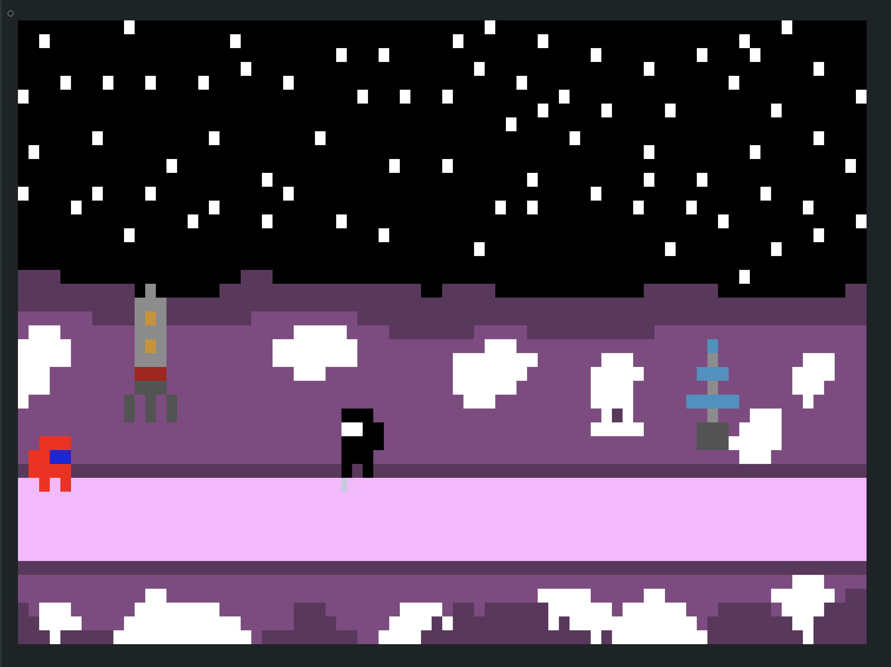

# Projet Agile : DinoDash

Saute pour éviter les obstacles !



## Team

- Thomas Gysemans
- Milleville Paul
- Bernard Ludovic
- Fourmaintraux Camille
- Top Jessy
- Demory Lea

## Comment lancer le projet ?

À la racine du projet, vous devez lancer le script suivant:

```bash
./play.sh
```

S'il ne s'exécute pas, essayez:

```bash
chmod +x ./play.sh
```

**Assurez-vous que vous le lancez depuis son dossier parent.**

## Organisation

Plus de détails sont disponibles quant à notre organisation (en mode Agile) dans le dossier [doc](./doc).